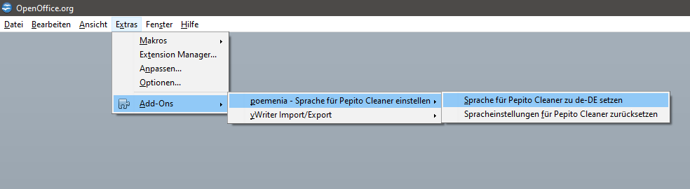
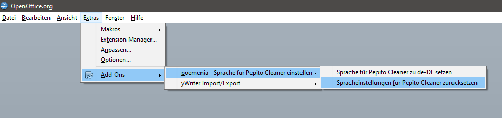
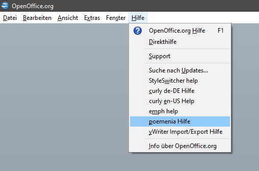

[Project homepage](https://peter88213.github.io/poemenia/)

## Anwendungshinweise für die  _poemenia_ -Erweiterung

## Sprache für Pepito Cleaner zu "de-DE" setzen

Damit wird die Benutzeroberfläche eingedeutscht. Außerdem berücksichtigt Pepito Cleaner Anführungszeichen nach den Regeln für Deutschland und Österreich. Es sind Gänsefüßchen („...“) oder Chevrons (»...«) möglich.

Die Konfiguration der Suchmuster wird gesichert und durch die Konfiguration von  _poemenia_  ersetzt.

Nach erfolgreicher Beendigung erscheint eine Meldung.

## Spracheinstellungen für Pepito Cleaner zurücksetzen

Damit wird die Benutzeroberfläche auf die zuvor eingestellte Sprache gesetzt. Die zuvor konfigurierten Suchmuster werden wiederhergestellt.

Nach erfolgreicher Beendigung erscheint eine Meldung.

## Hilfe

Im  __Hilfe__ -Menü gibt es ein  __poemenia Hilfe__ -Untermenü. 

