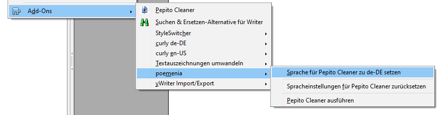
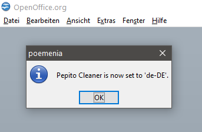

[Projekt-Homepage](https://peter88213.github.io/poemenia/) > Anwendungshinweise

------------------------------------------------------------------------

# Anwendungshinweise für die poemenia-Erweiterung

## Vor dem Aufruf von poemenia

__Achten Sie unbedingt darauf, dass das Programmfenster von Pepito Cleaner geschlossen ist!__

## Sprache für Pepito Cleaner zu "de-DE" setzen

**Hauptmenü: Extras > Add-Ons > poemenia > Sprache für Pepito Cleaner zu de-DE setzen**

Damit wird die Benutzeroberfläche deutschsprachig. Außerdem berücksichtigt Pepito Cleaner deutsche Interpunktionsregeln und erkennt Anführungszeichen, die in Deutschland und Österreich üblich sind. Es sind Gänsefüßchen („...“) oder Chevrons (»...«) möglich.

Die Konfiguration der Suchmuster wird gesichert und durch die Konfiguration von poemenia ersetzt.

Nach erfolgreicher Beendigung erscheint eine Meldung.

## Spracheinstellungen für Pepito Cleaner zurücksetzen

**Hauptmenü: Extras > Add-Ons > poemenia > Spracheinstellungen für Pepito Cleaner zurücksetzen**

Damit wird die Benutzeroberfläche auf die zuvor eingestellte Sprache gesetzt. Die zuvor konfigurierten "regex"-Suchmuster werden wiederhergestellt.

Nach erfolgreicher Beendigung erscheint eine Meldung.

## Pepito Cleaner ausführen

**Hauptmenü: Extras > Add-Ons > poemenia > Pepito Cleaner ausführen**

Damit kann man *Pepito Cleaner* auch starten.

## Hilfe

**Hauptmenü: Hilfe > poemenia Hilfe**

Im  __Hilfe__ -Menü gibt es ein  __poemenia Hilfe__ -Untermenü. 

