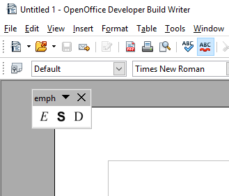
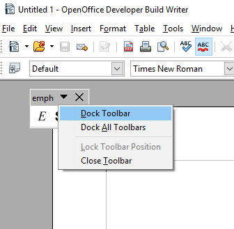
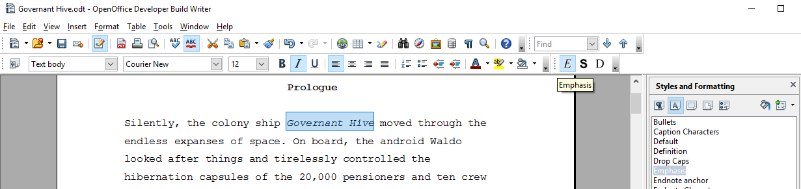
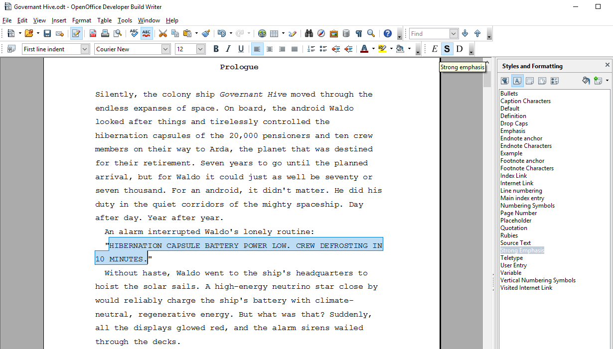
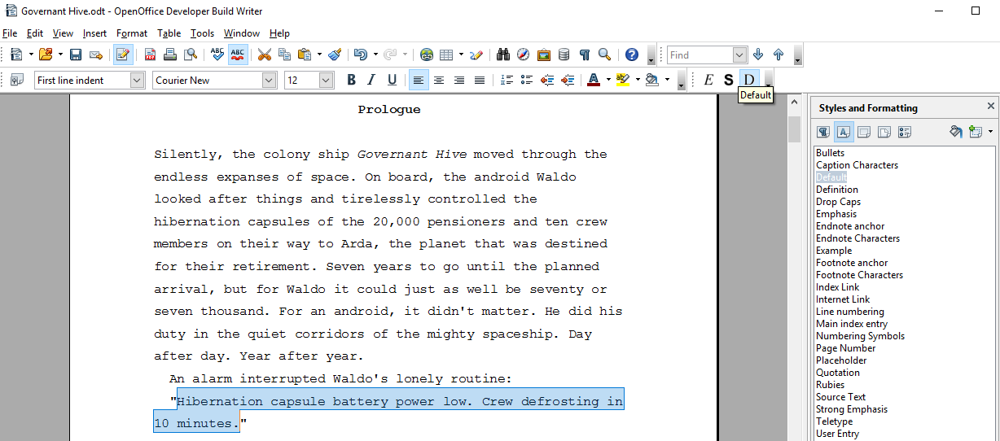
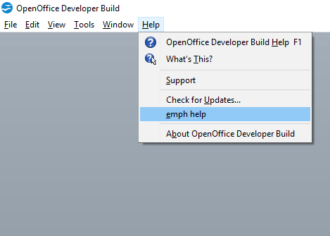

[Project homepage](https://peter88213.github.io/emph/)

## Instructions for use

## Place the toolbar

After installing the extension and restarting the office application, you will see a small toolbar. 

You can dock it to a suitable place on the user interface.

## Use the toolbar

There are three buttons:  __E__  for emphasize and  __S__  for strong emphasize and  __D__  for default style.

### Assign "Emphasis" character style

1. Mark the text passage you want to emphasize.
2. Click on the  __E__  button. 

### Assign "Strong Emphasis" character style

1. Mark the text passage you want to emphasize.
2. Click on the  __S__  button. 

### Undo the assignment

1. Mark the text passage you want to de-emphasize.
2. Click on the  __D__  button.

### Enter emphasized text

1. Make sure that nothing is marked. 
2. Click on the  __E__  button.
3. Type the text you want to emphasize.
4. When finished, click on the  __D__  button.

### Enter strongly emphasized text

1. Make sure that nothing is marked. 
2. Click on the  __S__  button.
3. Type the text you want to emphasize.
4. When finished, click on the  __D__  button.

## Get help

In the  __Help__  section of the main menu, there is a  __emph help__  submenu. 

