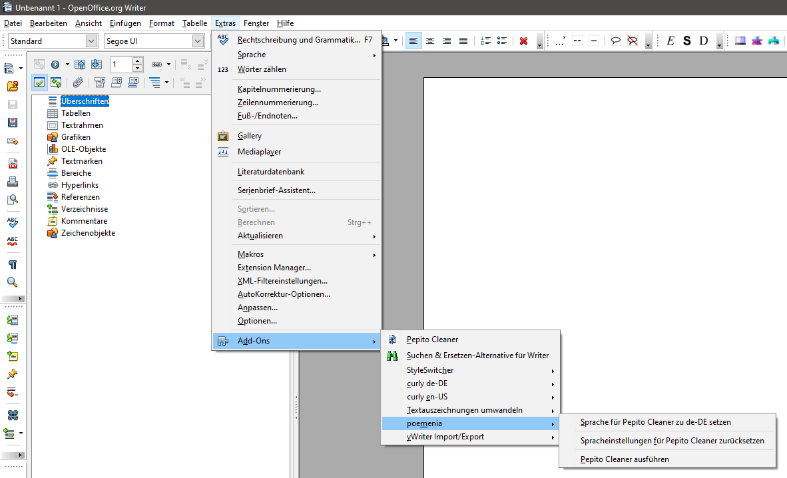

[English](index-en)

--------------------------

# Die poemenia-Erweiterung für OpenOffice und LibreOffice mit einem deutschen Sprachpaket für Pepito Cleaner

[Pepito Cleaner](https://pepitoweb.altervista.org/pepito_cleaner/index.php) ist eine überaus praktische Erweiterung, mit der man gängige Fehler, wie sie z.B. bei Scans oder bei der Extraktion von Texten aus PDF-Dokumenten entstehen, aufspüren und korrigieren kann. Das geschieht überwiegend mit Suchmustern, sogenannten regulären Ausdrücken. 

Die voreingestellten regulären Ausdrücke in Pepito Cleaner erkennen hochgestellte Anführungszeichen, wie sie in den USA üblich sind, außerdem *Guillemets* wie z.B. in Italien und in der Schweiz verwendet. Damit Pepito Cleaner die in Deutschland und Österreich gebräuchlichen Gänsefüßchen („...“) und Chevrons (»...«) als öffnende und schließende Anführungszeichen erkennt, muss der Benutzer die regulären Ausdrücke selbst ändern. Solche Änderungen erfordern allerdings Fachwissen und sind nicht leicht auf andere Installationen zu übertragen. Außerdem gehen sie bei einem Update oder einer erneuten Installation von Pepito Cleaner wieder verloren. 

Die *poemenia*-Erweiterung hilft diesem Problem ab, indem sie vorgefertigte Konfigurationsdateien in das Installationsverzeichnis von Pepito Cleaner kopiert und ihn damit lokalisiert. Vorhandene Konfigurationsdateien werden dabei gesichert, damit die Lokalisierung auch wieder rückgängig gemacht werden kann.

Das "de-DE"-Sprachpaket von poemenia übersetzt die Benutzeroberfläche von Pepito Cleaner (soweit möglich) und passt das Verhalten an die in Deutschland und Österreich üblichen Interpunktionsregeln an. Poemenias Überprüfungsregeln enthalten einige Zusätze, z.B. für die korrekte Setzung von Apostrophen, Gedankenstrichen und unterschiedlichen Anführungszeichen.

## Weitere Sprachen

Obwohl derzeit nur ein deutsches Sprachpaket verfügbar ist, kann man *poemenia* dank des modularen Aufbaus auch weitere Sprachpakete hinzufügen. Eine Anleitung dazu finden Sie auf der [Projektseite](https://github.com/peter88213/poemenia).

## Systemanforderungen

* **OpenOffice.org 3.x** oder **Apache OpenOffice 4.x**  oder **LibreOffice 6+**
* **Pepito Cleaner** muss installiert sein.

## Herunterladen und installieren

* [Herunterladen (poemenia-0.3.0.oxt)](https://raw.githubusercontent.com/peter88213/poemenia/main/poemenia-0.3.0.oxt)

* Installation direkt beim Download, durch Doppelklick auf die heruntergeladene Datei, oder über den OpenOffice/LibreOffice Extension Manager.

* Nach der Installation (und dem Neustart von Office) finden Sie im Menü **Extras/Add-ons** ein neues Untermenü.

[Änderungshistorie](changelog)

## Benutzung

Siehe [Benutzungshinweise](help-de)

## Aktualisierungen erhalten

Diese Extension unterstützt den Update-Mechanismus von OpenOffice/LibreOffice. Sie können von Zeit zu Zeit den Extension Manager nach Updates suchen lassen, um das aktuelle Release zu erhalten. 

## Credits

[Pepito Cleaner](https://pepitoweb.altervista.org/pepito_cleaner/index.php) by the Guys From Italy

[OpenOffice Extension Compiler](https://wiki.openoffice.org/wiki/Extensions_Packager#Extension_Compiler) by Bernard Marcelly.

## License

Diese Erweiterung steht unter der [MIT License](http://www.opensource.org/licenses/mit-license.php).
